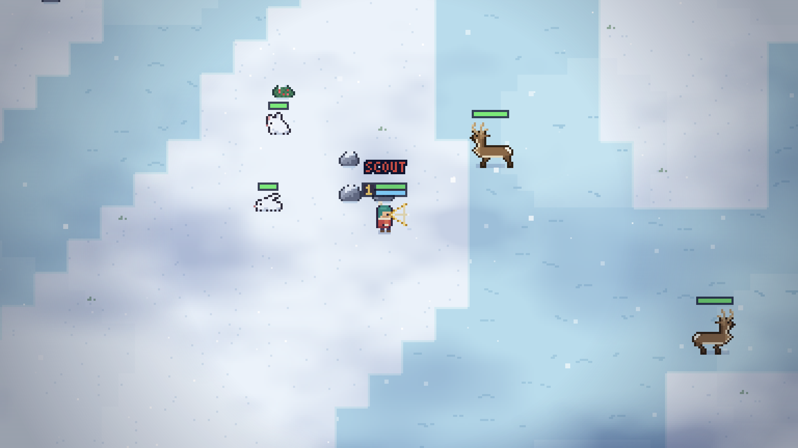
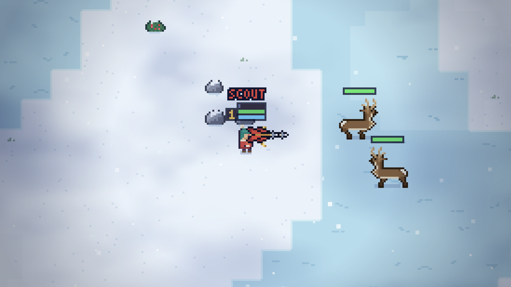
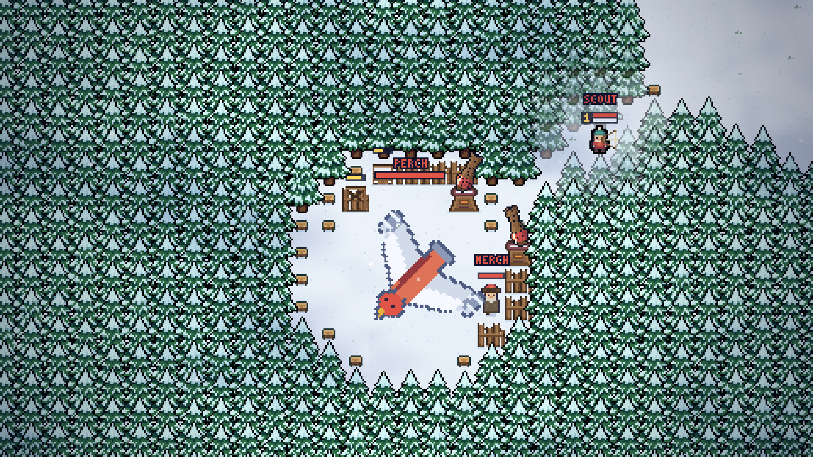
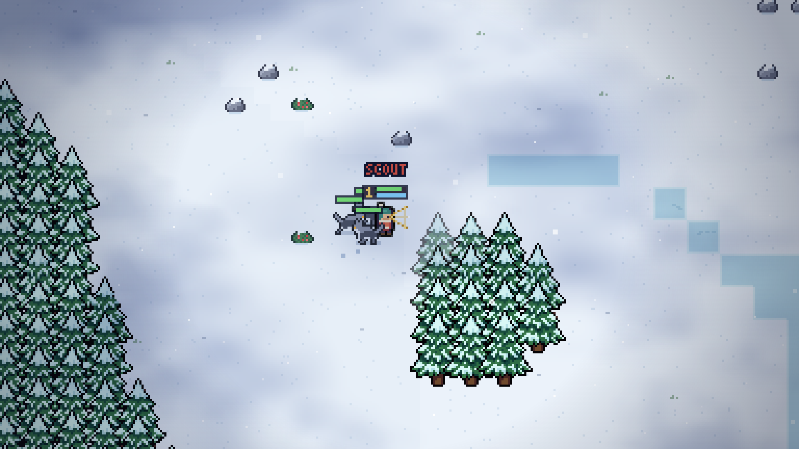
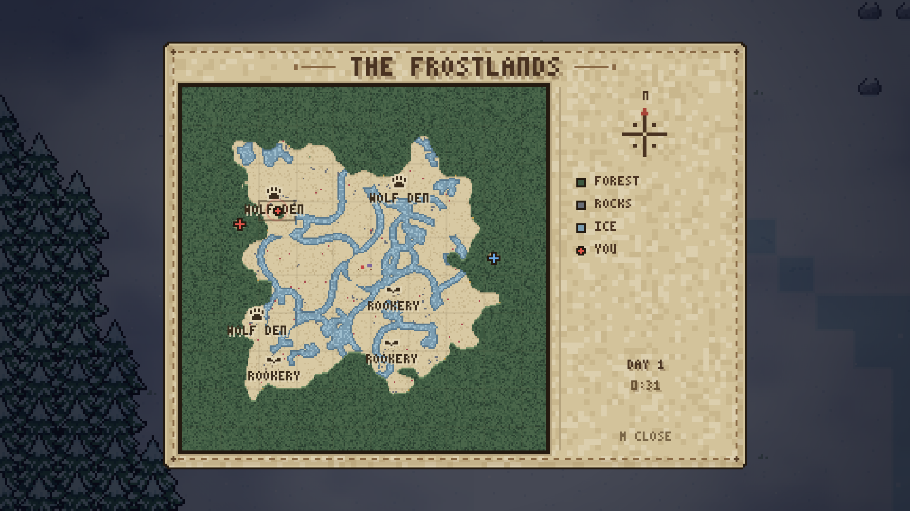
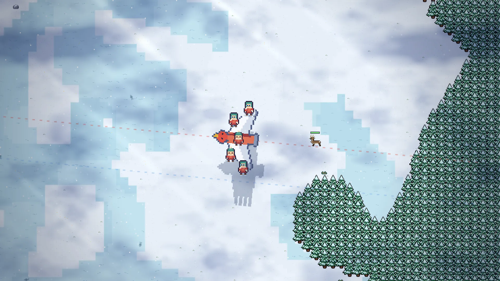
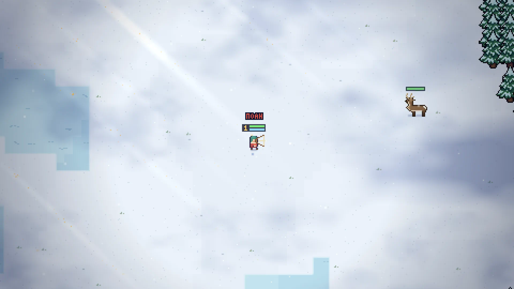
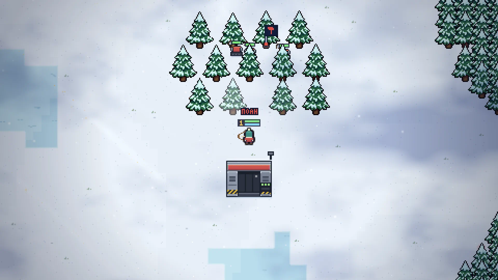

# Softfall

**Genre:** Action, Indie

**Short description:** Softfall is a cozy pixel-art survival team battle on a snowbound map. Ten scouts drop in by eagle, two teams of five, then hunt, chop, bury themselves in the drift and fight for the birds that carried them in: drive off the rival eagle and the match is won. Go down and you come back at your own.

**Tags:** Survival, Pixel Art, Cozy, Team-Based, Top-Down, PvP, Multiplayer, Base Building, Hunting, Winter, Roguelike, Action, 2D, Indie

---

  

  

  

  

  

---

## Coming soon

  <strong>COMING SOON TO STEAM</strong> 
  Wishlist Softfall and you will hear the day the eagles fly.

| | |
| --- | --- |
| **Release** | Coming soon |
| **Platform** | Windows |
| **Players** | Single-player: two teams of five, your four team-mates and the five rivals played by AI at NORMAL, HARD or IMPOSSIBLE |
| **Price** | To be announced |

---

## About this game

Softfall is a cozy survival game and a war at the same time. The snowfield is quiet, the pines are pretty, and nine other scouts are out there on it with you.

  

**Two birds, one diagonal.** Both teams fly in on armoured eagles that cross mid-route, and nobody starts at a spawn camp: jump when the door opens, or ride the bird down into its corner of the treeline. Where it lands is your base. The crater it blows, the gate its merchant raises and the lane that falls open to the snow are yours to fortify before you walk out. That bird is also the only objective. Spook the rival eagle until its nerve breaks and it flies away with the match. Go down yourself and you wait out a timer and land back at your own.

  

**The draw is the ammunition.** There is no quiver. How long you hold the string is how far, how fast and how hard the shot lands, and spamming the button is punished by the shots themselves, never by a counter. Deer wander the clearings, rabbits are white on white until they bolt, and the wolves come from one den that is marked on your map. Everything pays the same coin: one currency, earned by the swing, the shot and the clock, and every coin levels you on its way into your pocket.

  

**Your weapon is something you build.** A tool is a body with a rate of fire and a few cells. What comes out of it is the bits you load: a plain arrow, a log that arcs down and flattens whoever it lands on, a wisp that circles you lighting the dark, or a modifier that rewrites every shot on that tool at once. None of it is bought. All of it is found, in broken rocks, felled pines and the treeline's chests, so the weapon you finish a match with is one the map handed you a piece at a time. Plant a flag and worker bots chop, clear a lane or guard a wall. Buy gear from anywhere with no trip home. Spring a chest and the card it drops is baked into your kit for the rest of the match.

  

**Learn the string before the match.** Knock the ice off the practice plank and step onto a training field cut to pure combat: a mending dummy, a bell-rung archery round on a target track, and a timed ice-parkour loop through the pines. Nothing in it counts and nothing in it is at stake.

**Every scout carries a class.** The HUNTER's piercing shot, net, grapple and snow cover. The WARRIOR's shield, rush, stomp and juggernaut. Four keys, each with a cast the body visibly performs and effects drawn plainly for both sides: readable first, sneaky second.

### Key features

- Ten-slot team battles, five a side, on a seeded winter map you can share by number
- One objective: drive off the rival eagle. Kills never end a match
- A bow with no ammo. The draw is the throttle
- Tools and bits found on the map and never bought: a weapon you assemble mid-fight
- Two classes with four abilities each, and gear in four pieces and three variants bought from anywhere
- Worker bots, walls, turrets, fish nets on ice holes, and roguelike cards from treeline chests
- Momentum movement: slippery ice, chained dodges, and a roll that is a hit
- Day and night, wind that moves every pine, and a whole arsenal unlocked from the first match
- Runs from a double-click: no install, no account, no sign-in

---

## Details

| | |
| --- | --- |
| **Developer** | Softfall |
| **Publisher** | Softfall |
| **Support** | softfallbusiness@gmail.com |
| **Languages** | English |
