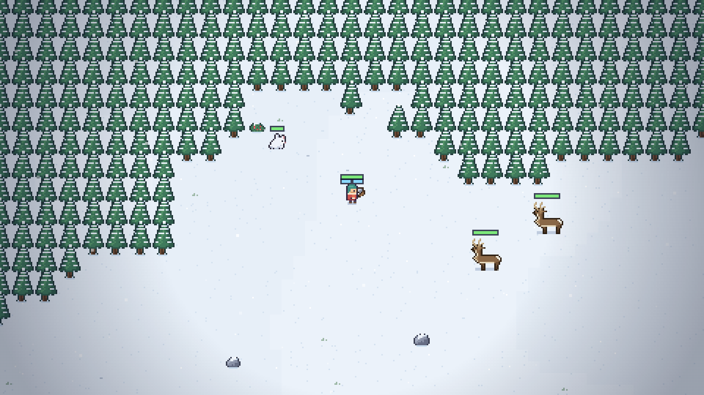
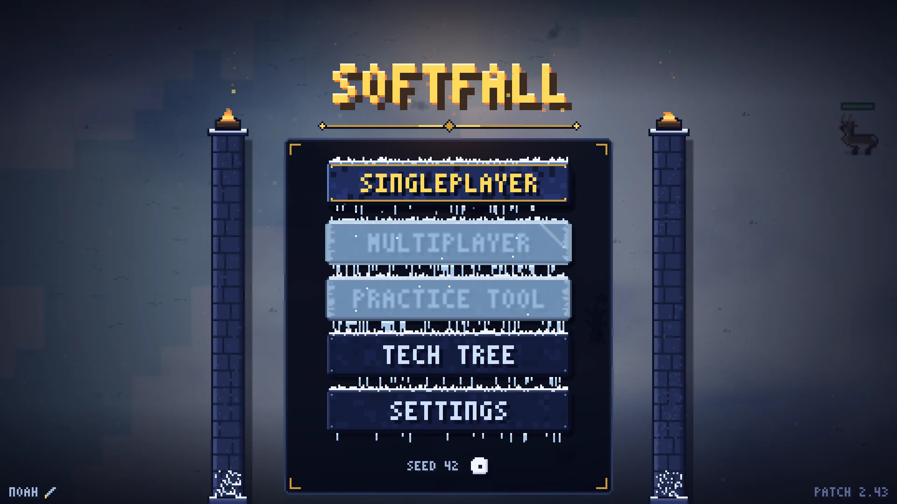
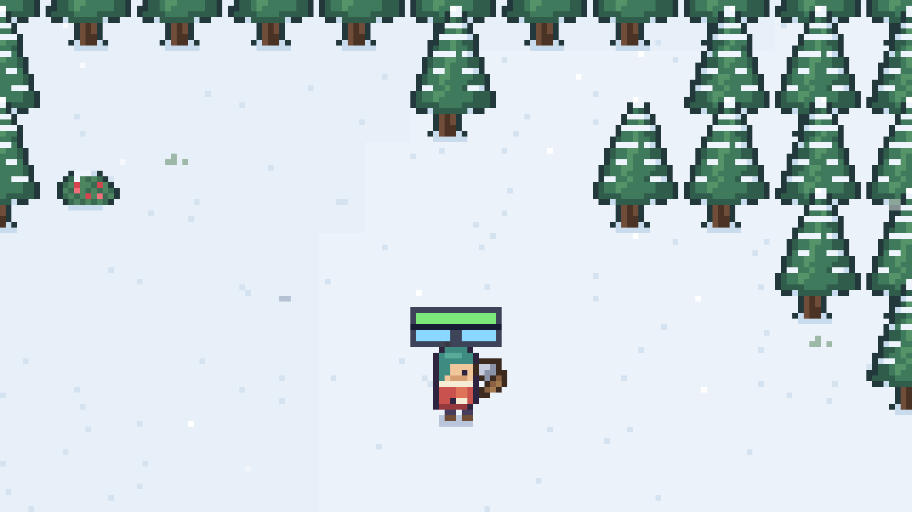
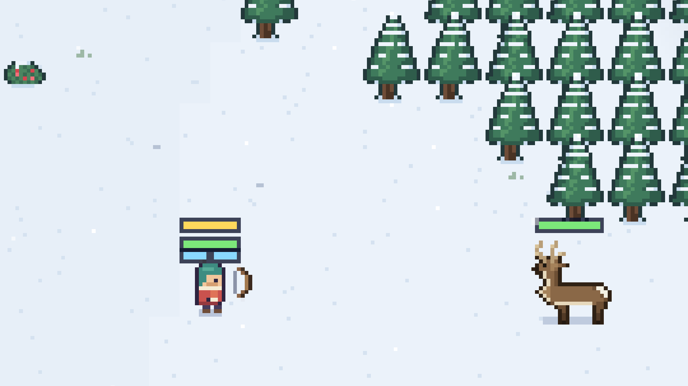
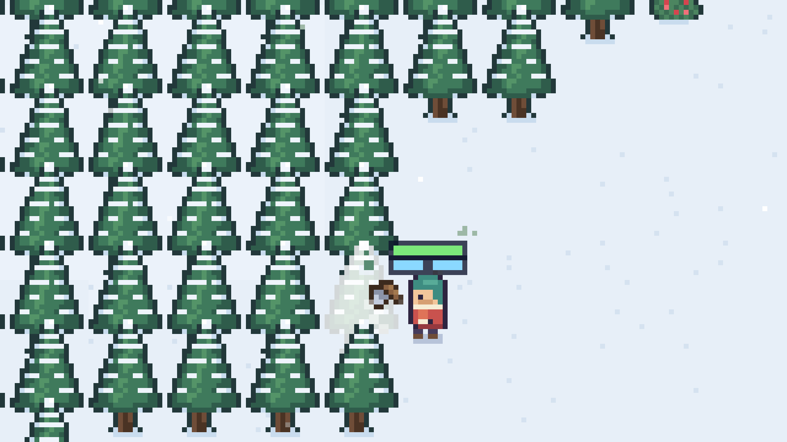
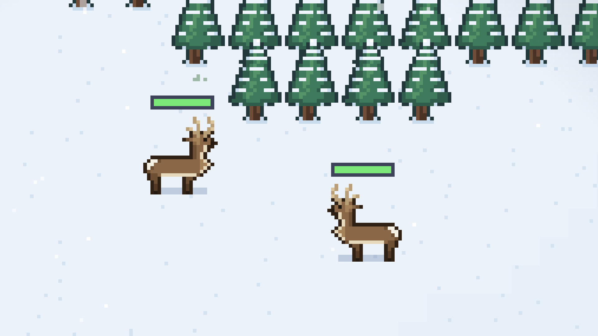
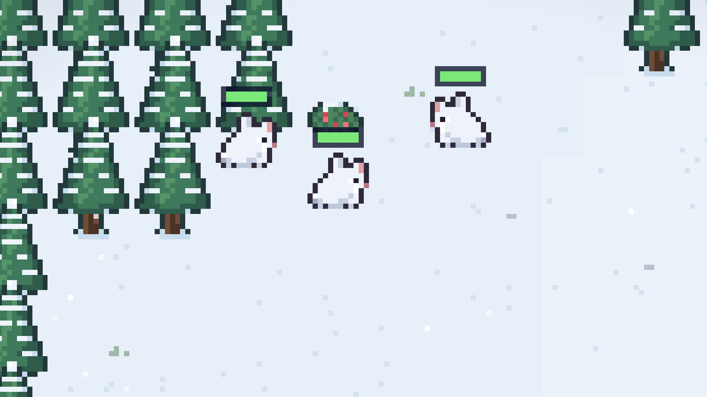
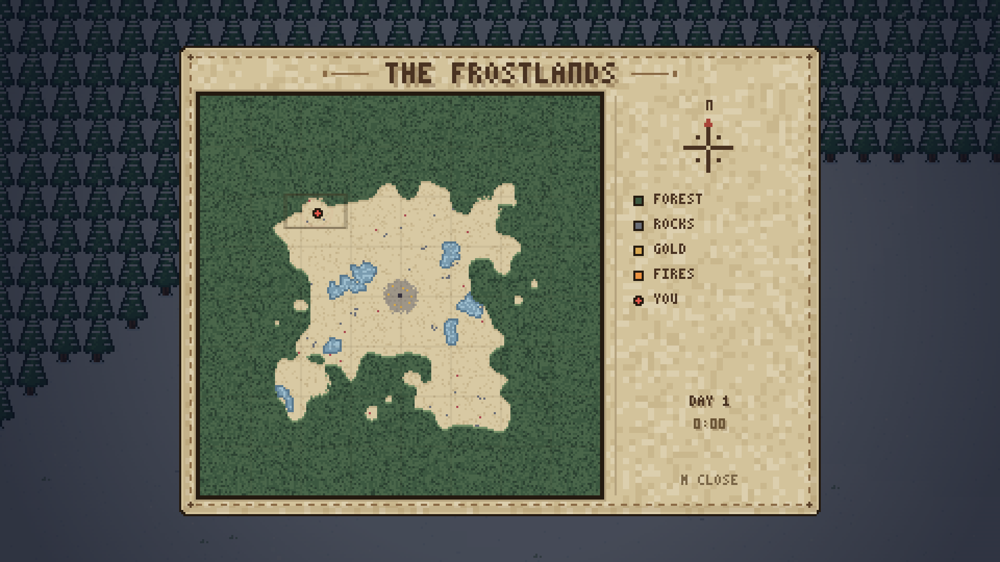

<h1 align="center">Project: Softfall</h1>
<p align="center">A cozy survival free-for-all on a winter map</p>

<p align="center">
  
</p>

<p align="center">
  <strong>Six drop in by eagle. Four teams. Last one standing keeps the snow.</strong>
</p>

<p align="center">
  
</p>

<table>
<tr>
<td align="center" valign="middle" width="50%">

</td>
<td align="center" valign="middle" width="50%">
<strong>YOU, AND FIVE OTHERS</strong>
<p>One of six on a 3712-pixel snowfield, split across four teams. Health over your head. Two rolls left in the ice. The woods are bigger than you and you are not alone in them.</p>
</td>
</tr>
<tr>
<td align="center" valign="middle" width="50%">

</td>
<td align="center" valign="middle" width="50%">
<strong>THE BOW</strong>
<p>Always in your hands — there is nothing to swap to. Hold the draw: the meter goes white, then gold. But the arrows run out, and every shaft you miss with stands in the snow for whoever walks past next.</p>
</td>
</tr>
<tr>
<td align="center" valign="middle" width="50%">

</td>
<td align="center" valign="middle" width="50%">
<strong>ONE KEY, ONE CURRENCY</strong>
<p>E takes the tree down, the rock apart, and an enemy wall with it. Everything pays the same thing: gold. There is no wood and no stone — only how fast a swing turns into coin.</p>
</td>
</tr>
<tr>
<td align="center" valign="middle" width="50%">

</td>
<td align="center" valign="middle" width="50%">
<strong>GOLD IS ALSO XP</strong>
<p>Deer wander the clearings with a full bar over their antlers, and they pay well. Every coin you earn levels you on the way into your pocket. Spend it on gear from anywhere — no shop, no trip home.</p>
</td>
</tr>
<tr>
<td align="center" valign="middle" width="50%">

</td>
<td align="center" valign="middle" width="50%">
<strong>QUIET THINGS</strong>
<p>Rabbits are white on white until they move, and they bolt when you close in. Nothing out here wants to hurt you — except the wolves, and they only come from one place, and it is marked.</p>
</td>
</tr>
<tr>
<td align="center" valign="middle" width="50%">

</td>
<td align="center" valign="middle" width="50%">
<strong>MAP</strong>
<p>The whole winter on one parchment — forest, ice, the landmarks worth walking to, and every base anyone has managed to raise. It does not pause the game while you read it.</p>
</td>
</tr>
</table>

## The match

**Your Keep is your way back.** Raise one, and dying costs you a walk. Lose it, and dying costs
you the game — no living Keep means permadeath. It is also what turns gold into **roguelike
cards**: pick one of three, keep it for the rest of the run.

**Lie down and disappear.** Ctrl puts you flat and the snow closes over you. It is not a visual
effect — a buried player is genuinely harder to see, and the shot that comes out of the snow hits
harder than an ordinary arrow.

**A roll is a hit.** Momentum is the movement here: ice carries you, dodges chain into each other,
and running someone down mid-roll is a real attack.

**Break the ice and you have a building site.** Two swings open a hole in a frozen lake, and the
hole takes a fish net — laid flat on the water, walked across rather than fallen into, hauling
fish out of a population that is genuinely there and genuinely finite.

**One flag, and where you plant it is the order.** Hold middle mouse to aim, release to plant.
A tree means cut there. Open ground means clear a lane. Your building means guard it. Anything
another team owns means go and take it apart.

## Run it

Double-click `index.html`. That is the whole thing — no install, no build step, no server. It is
one HTML file and five scripts, and it is meant to stay that way.

```
node tools/serve.js
```

Optional, and only for development: a static server on `http://localhost:8471` with a screenshot
sink. Nothing in the game may depend on being served.

## Building on it

Everything a contributor needs is in [CLAUDE.md](CLAUDE.md) and [docs/dev](docs/dev) — the design
in one page is [docs/dev/game.md](docs/dev/game.md), the file layout is
[docs/dev/architecture.md](docs/dev/architecture.md).
